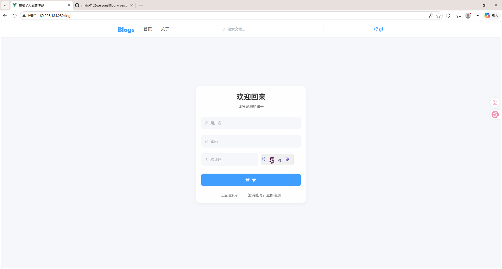
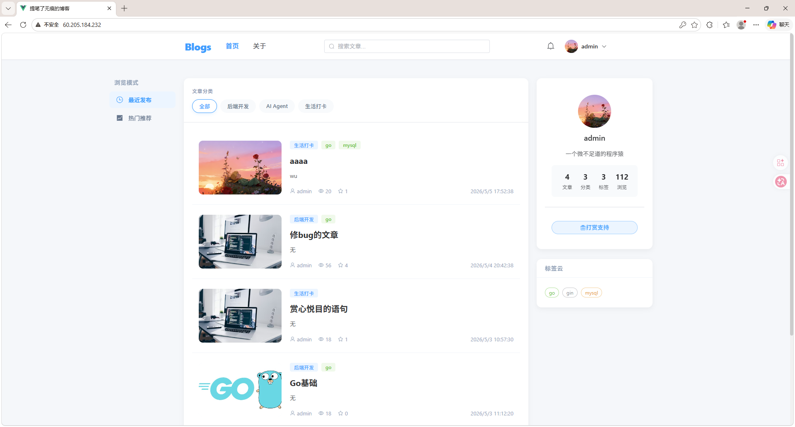
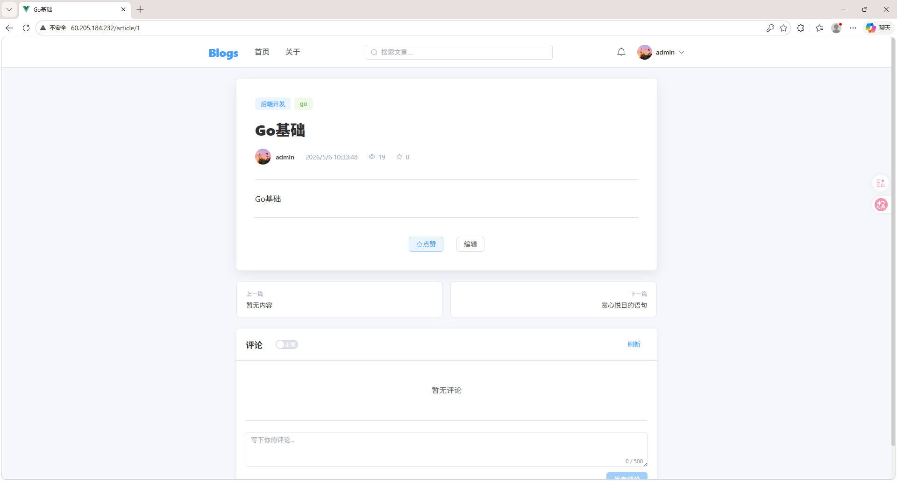
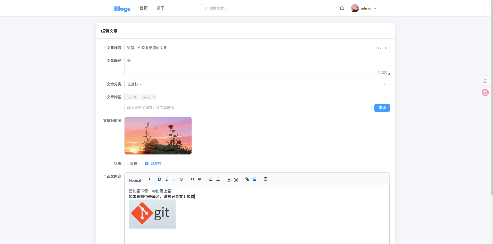
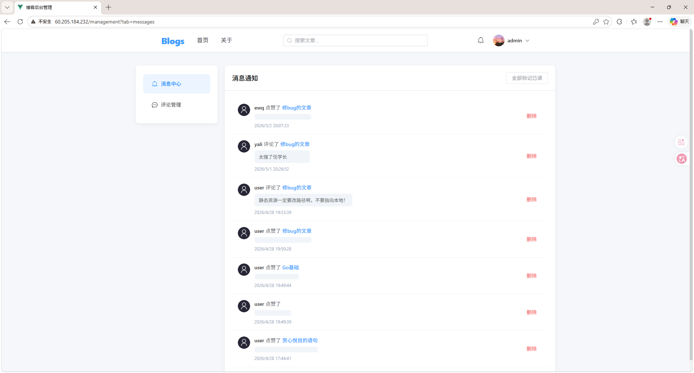
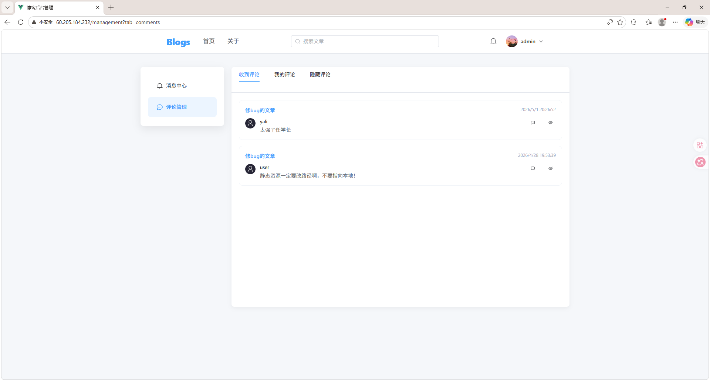
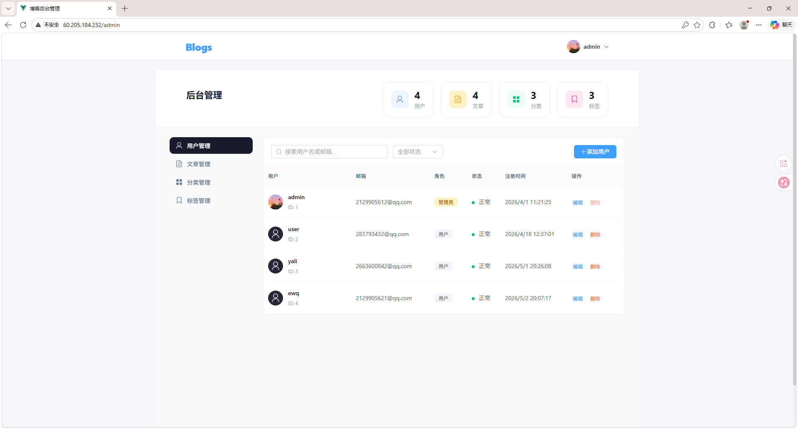

# Personal Blog System (简约个人博客系统)

> 一款基于 Go (Gin) + Vue 3 的高性能、前后端分离的个人博客与内容管理系统。

## 📝 开胃小菜：项目展示（Show）
**1）、登录页面：**



**注册，忘记密码页面不再展示**

**2）主页：**



**3）文章：**



**4）编辑文章：**



**5) 消息：**



**6）评论：**



**7）后台：**



## 1. 项目介绍 (Overview)

本项目是一个轻量级但功能完备的个人博客系统，采用现代化的前后端分离架构。后端基于 Go 语言和 Gin 框架构建，致力于提供高性能、高并发的 API 服务；前端采用 Vue 3 + Element Plus，提供极佳的用户交互体验。

无论是作为个人知识沉淀的后花园，还是作为 Go + Vue 全栈学习的实战参考，本项目都能满足您的需求。

### 项目背景 / 解决的问题

- 传统博客系统（如 WordPress）过于笨重，定制化成本高。
- 缺少一个能结合现代化前端框架（Vue 3）和高性能后端（Go）的轻量级开源替代方案。
- 提供一套包含文章发布、分类标签、用户管理及评论互动在内的完整解决方案。

## 2. 功能特性 (Features)

- **🔐 身份认证与安全**
  - 基于 JWT 的用户状态管理与 Token 刷新机制。
  - 密码使用 RSA 前端加密 + Bcrypt 后端哈希，双重保障安全。
  - 支持 Redis 缓存在线状态，支持管理员一键踢出违规用户（封禁即下线）。
- **📝 内容管理**
  - 强大的文章发布系统（集成富文本编辑器 Quill）。
  - 支持文章封面、摘要提取。
  - 文章状态管理（草稿/已发布）。
  - 灵活的分类（Category）与标签（Tag）系统。
- **👥 互动与通知**
  - 评论系统：支持文章评论及回复。
  - 消息中心：系统通知、互动提醒。
- **🛠 后台管理**
  - 可视化的数据统计与仪表盘。
  - 用户管理：管理员可以新增、编辑、封禁用户。
  - 标签与分类的统一维护。

## 3. 技术栈 (Tech Stack)

### 后端 (Backend)

- **核心语言**: Go 1.25+
- **Web 框架**: [Gin](https://github.com/gin-gonic/gin) (v1.12)
- **ORM 框架**: [GORM](https://gorm.io/) (v1.31) + MySQL Driver
- **缓存**: [Redis](https://github.com/redis/go-redis) (v9)
- **安全与认证**: JWT (v5), bcrypt, UUID
- **日志与配置**: Zap + Lumberjack, Viper

### 前端 (Frontend)

- **核心框架**: Vue 3 (Composition API)
- **路由管理**: Vue Router 4
- **UI 组件库**: [Element Plus](https://element-plus.org/) + @element-plus/icons-vue
- **网络请求**: Axios (包含完整的拦截器与异常处理)
- **富文本编辑器**: Quill 1.3.7

## 4. 安装与运行 (Installation & Usage)

### 环境依赖

- Go >= 1.25
- Node.js >= 16.x
- MySQL >= 8.0
- Redis >= 6.0

### 第一步：数据库与缓存准备

1. **启动 Redis 服务**
   确保本地已运行 Redis 服务（默认端口 `6379`）。
2. **初始化 MySQL 数据库**
   在您的 MySQL 中执行以下命令创建数据库：
   ```sql
   CREATE DATABASE IF NOT EXISTS blogs DEFAULT CHARACTER SET utf8mb4 COLLATE utf8mb4_unicode_ci;
   ```
*(注：项目启动时，GORM 会自动进行表结构的迁移和创建，无需手动导入 SQL 脚本)*

### 第二步：后端部署

1. 进入后端目录：
   ```bash
   cd blogs
   ```
2. 安装 Go 依赖：
   ```bash
   go mod tidy
   ```
3. 配置文件修改：
   打开 `blogs/config/config.yaml` (如果存在模板文件如 `config.example.yaml`，请先复制一份并重命名)，修改其中的数据库和 Redis 配置，例如：
   ```yaml
   mysql:
     dsn: "root:123456@tcp(127.0.0.1:3306)/blogs?charset=utf8mb4&parseTime=True&loc=Local"
   redis:
     addr: "127.0.0.1:6379"
     password: ""
   ```
4. 运行服务：
   ```bash
   go run main.go
   ```
   *后端服务默认运行在* *`http://localhost:8082`*

### 第三步：前端部署

1. 进入前端目录：
   ```bash
   cd vue
   ```
2. 安装依赖：
   ```bash
   npm install
   ```
3. 运行开发服务器：
   ```bash
   npm run serve
   ```
   *前端服务默认运行在* *`http://localhost:8080`*

## 5. 快速示例 (Examples)

这里提供一些简单的示例，帮助您快速了解系统的运作方式：

**1. 注册与登录管理员账号**
- 前端运行后，访问 `http://localhost:8080/login`
- 注册您的第一个账号。
- *提示：如果需要体验后台管理，可以在数据库 `users` 表中手动将您的账号 `role` 字段修改为 `admin`。*

**2. 测试获取文章列表接口 (Curl 示例)**
如果您想脱离前端直接测试后端 API：
```bash
# 获取已发布的文章列表 (第1页，每页10条)
curl -X GET "http://localhost:8082/api/article/list?status=published&page=1&pageSize=10" \
     -H "Accept: application/json"
```

## 6. 项目结构 (Project Structure)

```text
personalBlog/
├── blogs/                  # Go 后端目录
│   ├── internal/           # 内部业务逻辑
│   │   ├── api/            # 控制器层 (Controller/Router)
│   │   ├── middleware/     # 中间件 (Auth, Logger 等)
│   │   ├── model/          # 数据模型 (Entity, DTO)
│   │   ├── repository/     # 数据访问层 (MySQL, Redis)
│   │   └── service/        # 核心业务逻辑层
│   ├── pkg/                # 公共工具包 (JWT, Logger, Utils)
│   ├── main.go             # 后端入口
│   └── go.mod              # Go 依赖管理
│
└── vue/                    # Vue 3 前端目录
    ├── src/
    │   ├── assets/         # 静态资源
    │   ├── components/     # 公共组件
    │   ├── router/         # 路由配置
    │   ├── utils/          # 工具类 (axios 封装, RSA 加密等)
    │   ├── views/          # 页面视图 (Home, Admin, Article 等)
    │   ├── App.vue         # 根组件
    │   └── main.js         # 前端入口
    └── package.json        # Node 依赖管理
```

## 7. 贡献指南 (Contributing)

欢迎提交 Pull Request 或 Issue！

1. Fork 本仓库
2. 创建您的特性分支 (`git checkout -b feature/AmazingFeature`)
3. 提交您的修改 (`git commit -m 'Add some AmazingFeature'`)
4. 推送至分支 (`git push origin feature/AmazingFeature`)
5. 开启一个 Pull Request

## 8. License

Distributed under the MIT License. See `LICENSE` for more information.
